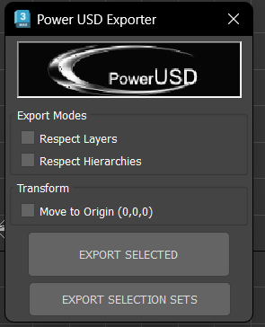
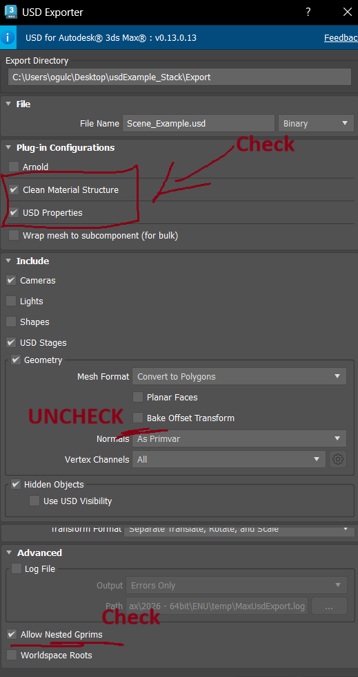
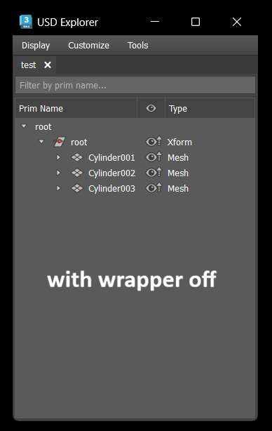
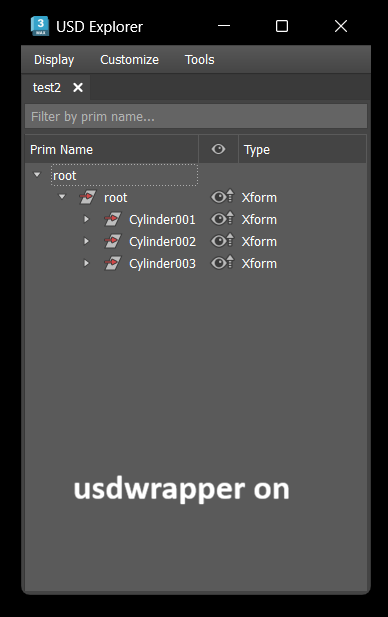
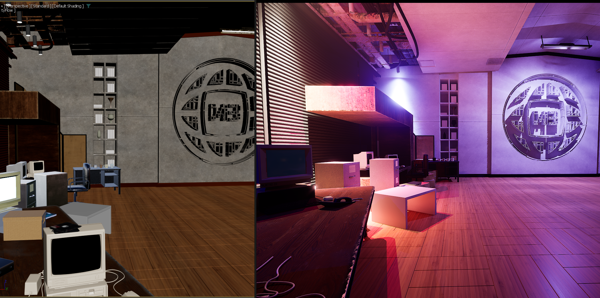

# PowerUSD for 3ds Max

Bulk USD exporter for 3ds Max built on top of MaxUSD. Handles hierarchy detection, instancing, variant sets, purpose switching, and automated stage assembly.



## Requirements

- 3ds Max 2026+
- MaxUSD plugin (USD for Autodesk 3ds Max v0.13+)

## Installation

Copy the contents to your 3ds Max user scripts directory:

```
%localappdata%\Autodesk\3dsMax\2026 - 64bit\ENU\scripts\CloneTools\
```

Files to copy:
- `powerusd.ms` - Main exporter macroscript
- `Clone_USD_AttributeDef.ms` - USD Properties modifier definition
- `chasers/Clone_USD_CleanStruct.py` - Material structure cleanup chaser
- `chasers/Clone_USD_PropertiesChaser.py` - Properties and root stripping chaser
- `chasers/Clone_USD_StageAssembler.py` - Stage assembly script
- `chasers/Clone_USD_usdWrapper.py` - Simple mode mesh wrapper chaser

Copy the `icons/` folder to:
```
%localappdata%\Autodesk\3dsMax\2026 - 64bit\ENU\usericons\PowerUSD\
```

The macroscript registers under **CloneTools** category. Assign it to a toolbar, menu, or shortcut.

## MaxUSD Export Settings

PowerUSD expects specific MaxUSD settings on the first export. The dialog only appears once per batch - subsequent files use the same settings.



Key settings:
- **Clean Material Structure**: CHECK (enables the chaser)
- **Bake Offset Transform**: UNCHECK
- **Export Materials / USD Preview Surface**: CHECK
- **Material Scope**: `mtl`

## Export Modes

### Simple Mode

Exports each hierarchy root or layer group as a separate USD file. No sub-hierarchy splitting.

- **By Layers** - One USD file per layer
- **By Hierarchies** - One USD file per hierarchy root (default)
- **Move to Origin** - Temporarily moves root to `[0,0,0]` for export

### Advanced Mode

Detects objects with **USD Properties** modifiers (P_USDparamobj) and splits hierarchies at those boundaries. The assembler then rebuilds the hierarchy as a composed USD stage.

Rules:
- Objects under a DummyObject export as one unit
- Native Max groups export as one unit
- Instances within a hierarchy are handled by MaxUSD automatically
- A P_USDparamobj **breaks** the hierarchy - it and everything under it (until the next P_USDparamobj) export as a separate file

## USD Properties Modifier

Click **Add USD Properties** in the UI to add the modifier to selected objects. Available properties:

| Property | Values | Description |
|----------|--------|-------------|
| Geom Type | (auto), Xform, Scope | Prim container type |
| Kind | (none), assembly, group, component, subcomponent, model | USD Kind metadata |
| Purpose | default, render, proxy, guide | Rendering purpose |
| Instanceable | true/false | GPU instancing flag |
| Hidden | true/false | Start invisible |
| Active | true/false | Prim active state |
| Asset Version | string | Version tracking in assetInfo |
| Draw Mode | default, bounds, origin, cards | Viewport draw mode |
| Payload | true/false | Use payload instead of reference |

## Filename Suffixes

Object names control assembly behavior through suffixes:

| Suffix | Effect |
|--------|--------|
| `_VARIANT1`, `_VARIANT2`, ... | Assembled into a VariantSet on the parent prim |
| `_RENDER` | Sets `purpose = render` |
| `_PROXY` | Sets `purpose = proxy` |
| `_GUIDE` | Sets `purpose = guide` |
| `_PAYLOAD` | Referenced as payload instead of reference |

Suffixes can be combined: `Chair_RENDER_VARIANT1`

## Stage Assembly

Enable **Auto Assemble Stage** to generate a `.usda` file that references all exported USDs with correct hierarchy, kind, purpose, variants, and payloads.

The assembler reads `_hierarchy.txt` metadata written during export and reconstructs the scene structure. Set **Default Prim** to name the top-level assembly prim (default: `World`).

## Chasers

### Clean Material Structure
Fixes MaxUSD material export structure. Do not disable.

### Properties Chaser
Post-export processing that:
- Reads USD Properties from Max Attribute Holders and writes them to USD prims
- Strips the `/root` wrapper that MaxUSD adds
- Remaps material binding paths after restructuring
- Handles variant set creation from `_VARIANT*` children
- Nests `/mtl` scope under the content prim for clean referencing

### USD Wrapper (Simple Mode)
Wraps exported meshes under a new Xform and sets kind to `subcomponent`. Used in simple mode only.

| Wrapper Off | Wrapper On |
|-------------|------------|
|  |  |

## Material Structure Cleanup

The Clean Material Structure chaser fixes MaxUSD's default material export to produce cleaner USD Preview Surface shaders.

| Clean Off | Clean On |
|-----------|----------|
|  |  |
|  |  |

## Additional Scripts

- `additional/promote_stage_To_Max.py` - Import assembled stage back into Max
- `additional/usdPreview_TO_RS.py` - Convert USD Preview Surface materials to Redshift
